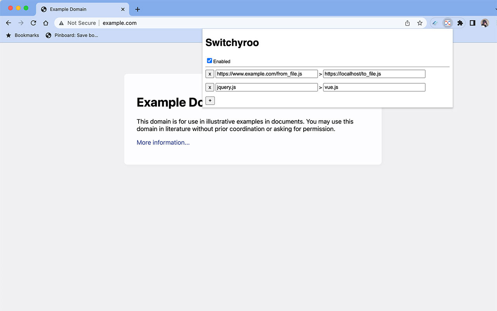

Switchyroo
==========

Chrome extension for re-writing URLs.

End-User Installation
---------------------
1. In Chrome, go to the Chrome Web Store Page: https://chrome.google.com/webstore/detail/switchyroo/pmldjmimejfcmfagbdpllcdakpimjjnk
2. Click "Add to Chrome"
3. Pin the extension so it's easy to access from the menu bar

Development
===========
To set yourself up for development:

1. Check out this repo.
2. Do `npm install` and `npm run build`. (Running `npm run build` the first time creates the dist/ directory.)
3. Go to chrome://extensions, and click" Load unpacked extension...". Select the dist/switchyroo directory.
4. Do `npm run watch` in your shell.
5. Develop as normal. You may need to reload the extension (click Reload in chrome://extensions).

Testing
=======
Run `npm run test` to run the unit tests. These will run automatically on watch too.

Deployment
==========
1. Do a `npm run publish:patch` (or `publish:minor` or `publish:major`). This will create a new version and bump the package file. It will also create an installable zip file in dist/switchyroo.zip.
2. Go to https://chrome.google.com/webstore/developer/dashboard and login .
3. Click edit on the extension.
4. Upload the switchyroo.zip file.
